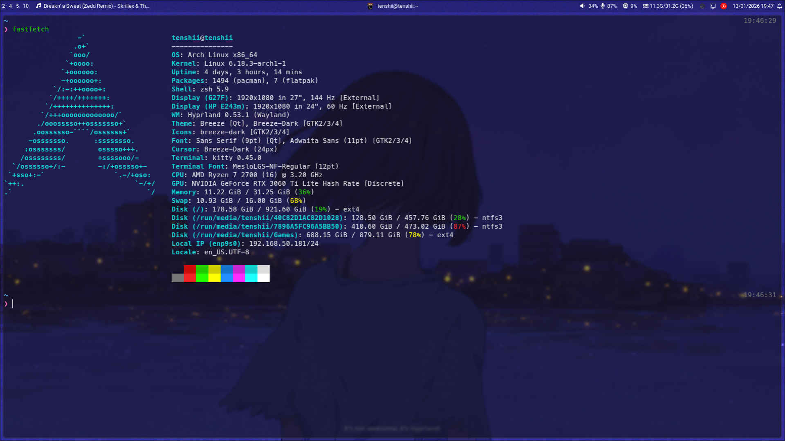
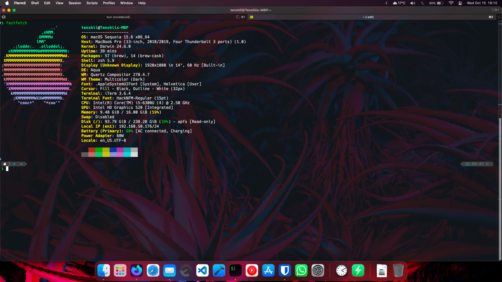

# dotfiles
random scripts and stuff

## What's there?

### .config

Config files for my Arch Linux setup, which includes kitty, Hyprland, zsh, waybar.

### vps

Scripts and crons used on my VPS. A `README.md` is included in the folder for more information.

## Arch Setup

### Hyprland Keybinds

- `Win+T`: open kitty
- `Win+Q`: kill active app
- `Win+M`: quit Hyprland
- `Win+E`: launch Dolphin file manager
- `Win+B`: toggle floating
- `Win+V`: clipboard history
- `Win+R`: exec something with rofi
- `Win+J`: toggle split
- `Win+L`: lock session
- `Win+N`: open notifications panel
- `Win+Shift+S`: take a screenshot
- `Win+.`: copy emoji

Others keybinds are those by default.

### Tools

- Terminal: [kitty](https://sw.kovidgoyal.net/kitty/)
- File Manager: [Dolphin](https://apps.kde.org/dolphin/)
- Wallpaper: [hyprpaper](https://wiki.hypr.land/Hypr-Ecosystem/hyprpaper/). For the wallpaper itself see [wallpaper.png](wallpaper.png).
- Web Browser: Firefox Nightly
- Display Manager: [SDDM](https://github.com/sddm/sddm) (theme: Breeze)

## Notes :)

### Packages to install

- SDDM Breeze theme: `plasma-desktop`
- Themes: `nwg-look` for GTK3, `qt6ct` for Qt6
- Keyring: `kwallet5`
- Zsh plugins: `zsh-autosuggestions`, `zsh-syntax-highlighting`

### Things to do

- VSCode keyring: https://code.visualstudio.com/docs/configure/settings-sync#_recommended-configure-the-keyring-to-use-with-vs-code