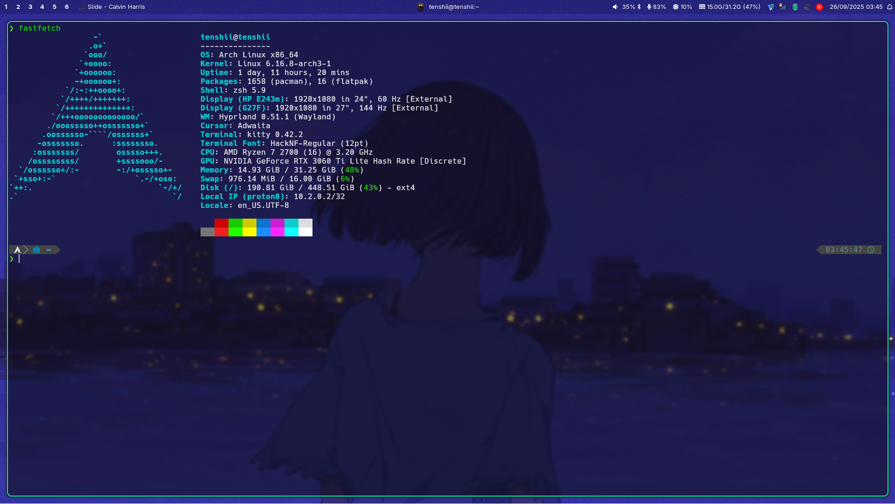

# dotfiles
random scripts and stuff

## What's there?

### .config

Config files for my Arch Linux setup, which includes kitty, Hyprland, zsh, waybar.

### vps

Scripts and crons used on my VPS. A `README.md` is included in the folder for more information.